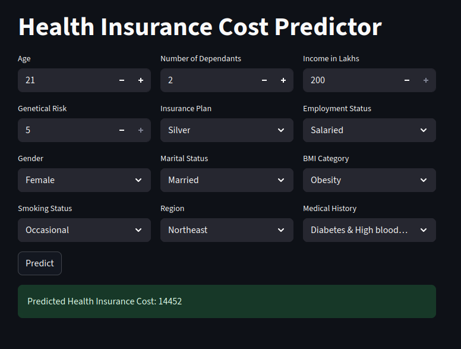

# 🏥 Health Insurance Cost Predictor

A **Streamlit** app that predicts health insurance premiums using a regression model built from demographic, lifestyle, and medical features.

🔗 **Live Demo:** [Streamlit App](https://ml-project-healthcare-premium-prediction-iwn8eit7kp4brxl3j8gdf.streamlit.app)

---

## 🚀 Features
- Inputs: Age, Dependants, Income, Gender, Marital Status, BMI Category, Smoking Status, Medical History, Employment, Region, Insurance Plan  
- Instant premium prediction via a trained ML model  
- Clean, simple UI powered by **Streamlit**

---

## 🛠️ Tech Stack
- **Python 3.x**
- **Streamlit** for the web interface
- **Scikit-learn** (ML model)
- **Pandas / NumPy** for preprocessing

---

## 📂 Project Structure
~~~text
.
├── app.py                 # Main Streamlit app
├── prediction_helper.py   # Prediction logic (ML model helper)
├── requirements.txt       # Python dependencies
└── README.md              # Project documentation
~~~

---

## ⚡ Run Locally
~~~bash
# Clone the repo
git clone https://github.com/your-username/healthcare-premium-prediction.git
cd healthcare-premium-prediction

# (Optional) create & activate a virtual environment
# python -m venv .venv && source .venv/bin/activate   # macOS/Linux
# python -m venv .venv && .venv\Scripts\activate      # Windows

# Install dependencies
pip install -r requirements.txt

# Run the app
streamlit run app.py
~~~

Open in your browser: `http://localhost:8501`

---

## 🧠 How It Works
- The Streamlit UI collects inputs and builds a dictionary of features.  
- That dictionary is passed to a `predict(...)` helper which loads the trained model and returns the estimated premium.  
- The predicted value is displayed on the page.  

---

## 📸 Screenshot (optional)

---

## 🔗 Links
- **Live App:** [Streamlit Deployment](https://ml-project-healthcare-premium-prediction-iwn8eit7kp4brxl3j8gdf.streamlit.app)  
- **My GitHub Profile:** [https://github.com/your-username](https://github.com/mmmuhammedcan)

---

## 🙏 Acknowledgments
Built as part of my ML learning journey with Codebasics companion; inspired by educational materials and real-world use cases.
